## Diagram

```mermaid
erDiagram

    animal {
        animal_id integer PK "not null"
        animal_code character_varying "not null"
    }

    experiment {
        experiment_id integer PK "not null"
        animal_id integer FK "not null"
        template_id integer FK "not null"
        experiment_start timestamp_without_time_zone "not null"
        experiment_end timestamp_without_time_zone "null"
    }

    protocol {
        protocol_id integer PK "not null"
        protocol_name character_varying "not null"
    }

    protocol_parameter {
        protocol_parameter_id integer PK "not null"
        protocol_id integer FK "not null"
        parameter_name character_varying "not null"
    }

    session {
        session_id integer PK "not null"
        task_id integer FK "not null"
        session_status character_varying "null"
        session_end timestamp_without_time_zone "null"
        session_start timestamp_without_time_zone "null"
    }

    stimulus_object {
        stimulus_object_id integer PK "not null"
        window_object_id integer FK "null"
        stimulus_touched boolean "null"
        stimulus_image_file character_varying "null"
        stimulus_outcome character_varying "null"
        stimulus_shape character_varying "null"
        stimulus_position_x integer "null"
        stimulus_position_y integer "null"
        stimulus_size_x integer "null"
        stimulus_size_y integer "null"
        stimulus_touch_x integer "null"
        stimulus_touch_y integer "null"
        stimulus_color_b numeric "null"
        stimulus_color_g numeric "null"
        stimulus_color_r numeric "null"
        stimulus_timeout_gain numeric "null"
        stimulus_flip_timestamp timestamp_without_time_zone "null"
        stimulus_release_timestamp timestamp_without_time_zone "null"
        stimulus_touch_timestamp timestamp_without_time_zone "null"
    }

    task {
        task_id integer PK "not null"
        experiment_id integer FK "not null"
        template_protocol_id integer FK "not null"
        complete boolean "null"
    }

    template {
        template_id integer PK "not null"
        template_name character_varying "not null"
    }

    template_protocol {
        template_protocol_id integer PK "not null"
        protocol_id integer FK "not null"
        template_id integer FK "not null"
        progression character_varying "not null"
        task_order integer "not null"
        rolling_window_size integer "null"
        target_sessions integer "null"
        target_trials integer "null"
        success_rate numeric "null"
    }

    trial {
        trial_id integer PK "not null"
        session_id integer FK "not null"
        trial_status character_varying "null"
        trial_end timestamp_without_time_zone "null"
        trial_start timestamp_without_time_zone "null"
    }

    trial_parameter {
        trial_parameter_id integer PK "not null"
        protocol_parameter_id integer FK "not null"
        trial_id integer FK "not null"
        stimulus_object_id integer FK "null"
        parameter_value character_varying "null"
    }

    window_object {
        window_object_id integer PK "not null"
        trial_id integer FK "not null"
        is_outside_fail boolean "not null"
        window_label character_varying "not null"
        window_delay numeric "not null"
        window_timeout numeric "not null"
        flip_timestamp timestamp_without_time_zone "not null"
        is_outcome boolean "null"
        window_transition character_varying "null"
        outside_fail_position_x integer "null"
        outside_fail_position_y integer "null"
    }

    animal ||--o{ experiment : "experiment(animal_id) -> animal(animal_id)"
    experiment ||--o{ task : "task(experiment_id) -> experiment(experiment_id)"
    protocol ||--o{ protocol_parameter : "protocol_parameter(protocol_id) -> protocol(protocol_id)"
    protocol ||--o{ template_protocol : "template_protocol(protocol_id) -> protocol(protocol_id)"
    protocol_parameter ||--o{ trial_parameter : "trial_parameter(protocol_parameter_id) -> protocol_parameter(protocol_parameter_id)"
    session ||--o{ trial : "trial(session_id) -> session(session_id)"
    stimulus_object ||--o{ trial_parameter : "trial_parameter(stimulus_object_id) -> stimulus_object(stimulus_object_id)"
    task ||--o{ session : "session(task_id) -> task(task_id)"
    template ||--o{ experiment : "experiment(template_id) -> template(template_id)"
    template ||--o{ template_protocol : "template_protocol(template_id) -> template(template_id)"
    template_protocol ||--o{ task : "task(template_protocol_id) -> template_protocol(template_protocol_id)"
    trial ||--o{ trial_parameter : "trial_parameter(trial_id) -> trial(trial_id)"
    trial ||--o{ window_object : "window_object(trial_id) -> trial(trial_id)"
    window_object ||--o{ stimulus_object : "stimulus_object(window_object_id) -> window_object(window_object_id)"
```

## Indexes

### `animal`

- `animal_pkey`

### `experiment`

- `experiment_pkey`

### `protocol`

- `protocol_pkey`

### `protocol_parameter`

- `protocol_parameter_pkey`

### `session`

- `session_pkey`

### `stimulus_object`

- `stimulus_object_pkey`

### `task`

- `task_pkey`

### `template`

- `template_pkey`

### `template_protocol`

- `template_protocol_pkey`

### `trial`

- `trial_pkey`

### `trial_parameter`

- `trial_parameter_pkey`

### `window_object`

- `window_object_pkey`
